<div align="center">

# Daily You

**A gamified self-improvement tracker where consistency earns points and slipping costs them.**

Set daily goals, log your sleep and macros, work through habit tasks, and spend what you earn
in the shop. Miss your targets and the points come back off — with a punishment wheel waiting
if your week ends in the red.

[**Live app**](https://daily-you-dun.vercel.app) · [**How it works**](https://daily-you-dun.vercel.app/about)


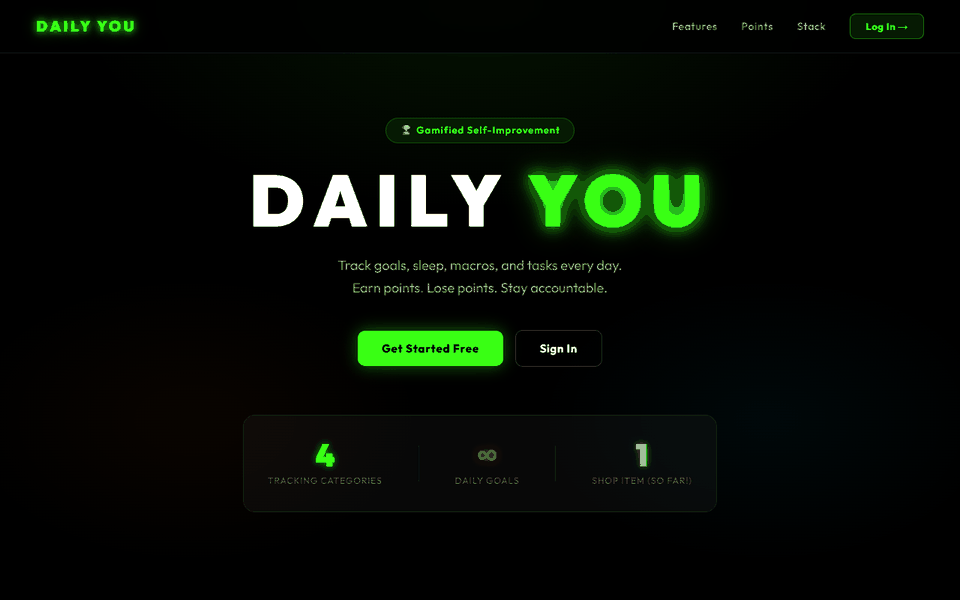

</div>

---

## Contents

- [What it does](#what-it-does)
- [Screenshots](#screenshots)
- [The points system](#the-points-system)
- [Architecture](#architecture)
- [Running it locally](#running-it-locally)
- [Environment variables](#environment-variables)
- [API reference](#api-reference)
- [Deployment](#deployment)
- [Design notes](#design-notes)
- [License](#license)

---

## What it does

Most habit trackers only ever reward you. Daily You is built on the idea that a score which
can only go up stops meaning anything — so every tracked category can take points away too.

| Module | What it tracks | How it scores |
| --- | --- | --- |
| **Goals** | Daily goals across High / Medium / Low priority tiers | Completion earns points, a miss costs more than the completion was worth |
| **Sleep** | Nightly sleep and wake times against a target you set | Scored on how far your actual duration lands from your own target |
| **Macros** | Daily protein, carbs and fats against your targets | Scored on your *combined* deviation across all three |
| **Tasks** | Lightweight recurring habit checklist | No penalties — a clean daily to-do list |
| **Shop** | Spend earned points | Freeze Cards and four collectible cars |
| **Items** | Your inventory | Activate a Freeze Card to neutralise a day's penalties |
| **Friends** | Shared game codes and a live leaderboard | Compare point totals with friends |
| **Wheel** | A punishment wheel | Unlocks only when your weekly balance goes negative |

Two mechanics tie it together:

**Deadlines are enforced, not suggested.** Each account has a daily deadline (default `23:59`).
Once it passes, any day left unsaved is auto-settled server-side with whatever state it was in —
so forgetting to log is itself a scored outcome. Deadlines set in the early morning (say `03:00`)
correctly treat the small hours as still belonging to the previous day.

**Bad weeks have consequences.** If your rolling weekly total drops below zero, the Punishment
Wheel unlocks and has to be spun. The slots are yours to define — the defaults run from
"10 Pushups" to "Give friend $5" — and are capped between 2 and 10 entries.

Escape hatches exist so the system stays honest rather than merely punishing: blacklist specific
days to skip them without penalty, disable a whole category from scoring if it doesn't apply to
you, or spend 15 points on a Freeze Card to write off a single bad day.

---

## Screenshots

### Landing page

The public overview at `/about` — reachable without an account, and linked directly from the
sign-in screen.

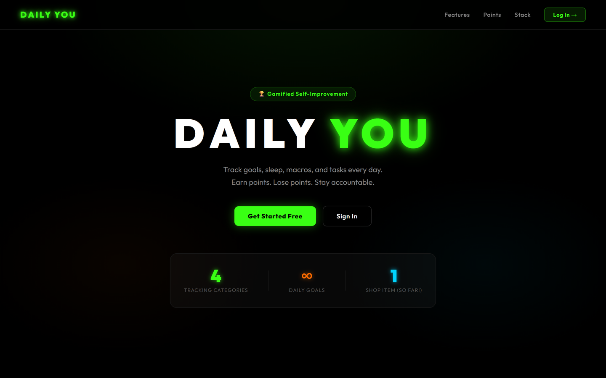

### Sign in

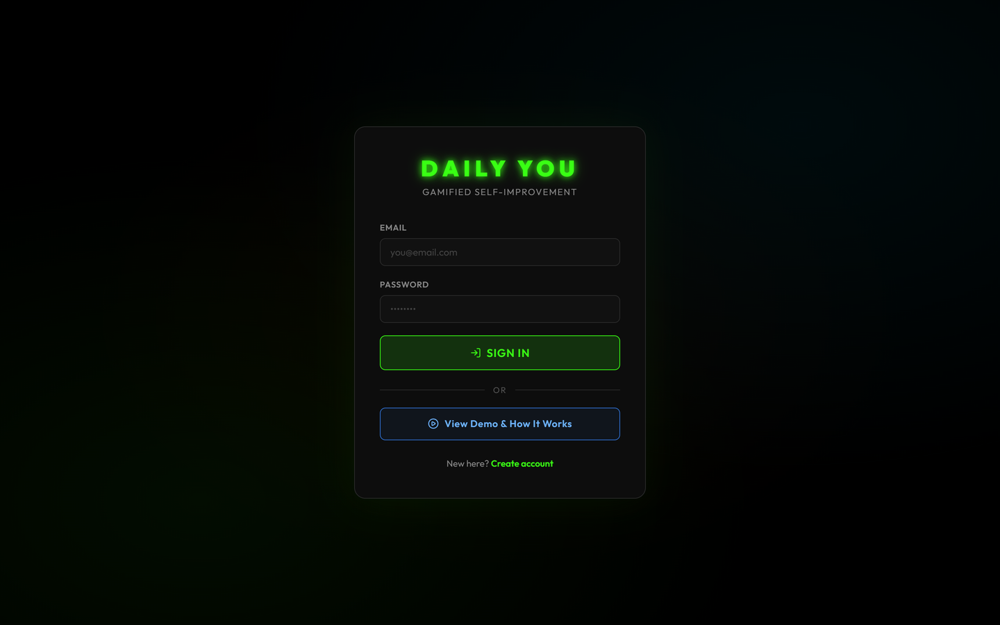

### Goals

The month grid. Each row is a goal, each column a day. Green marks a saved completion, red a
miss with its point cost, and neutral zeros are days before the goal existed.

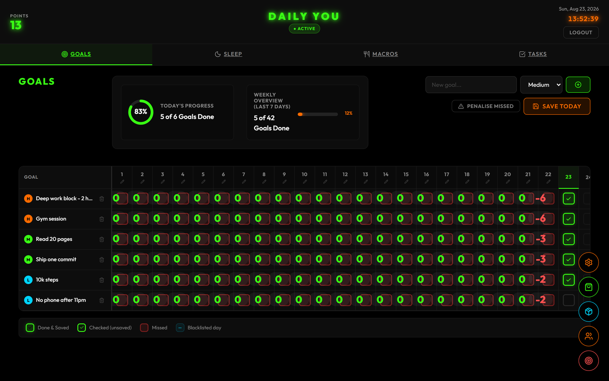

### Sleep and macros

<table>
<tr>
<td width="50%">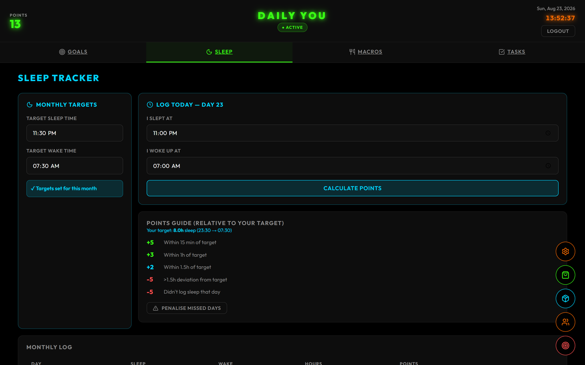</td>
<td width="50%">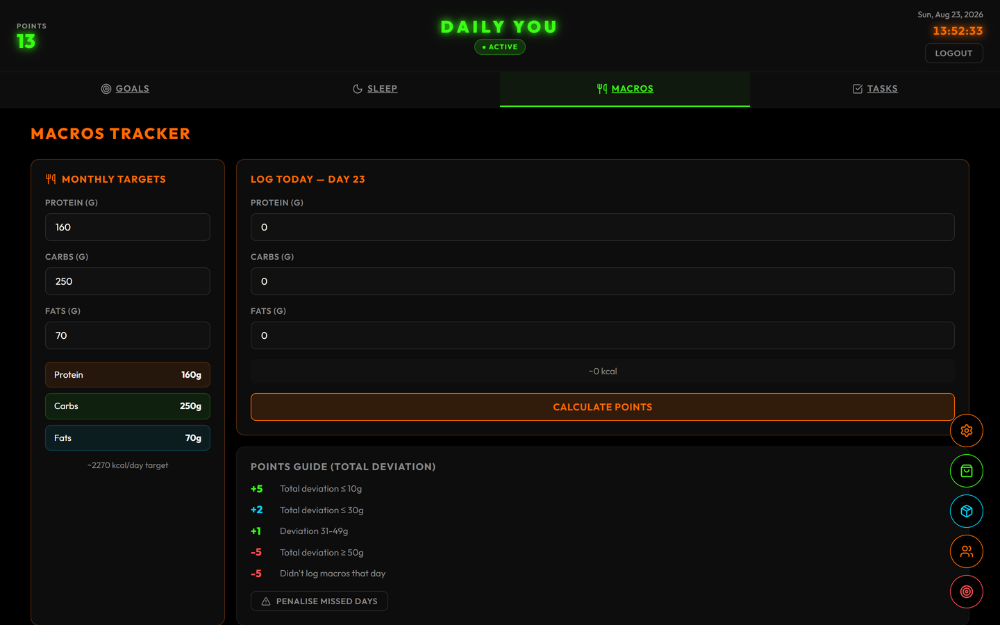</td>
</tr>
</table>

### Tasks and shop

<table>
<tr>
<td width="50%">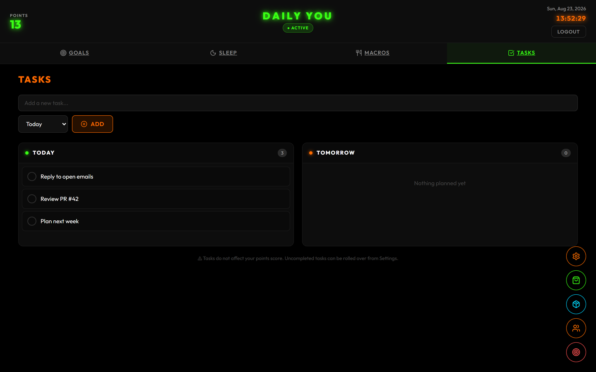</td>
<td width="50%">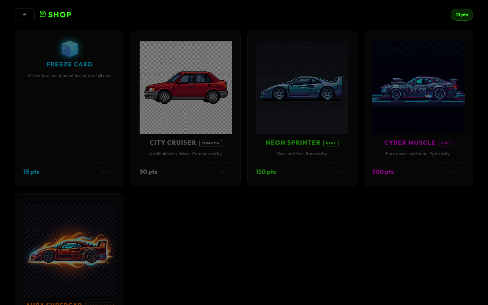</td>
</tr>
</table>

### Punishment wheel and inventory

<table>
<tr>
<td width="50%">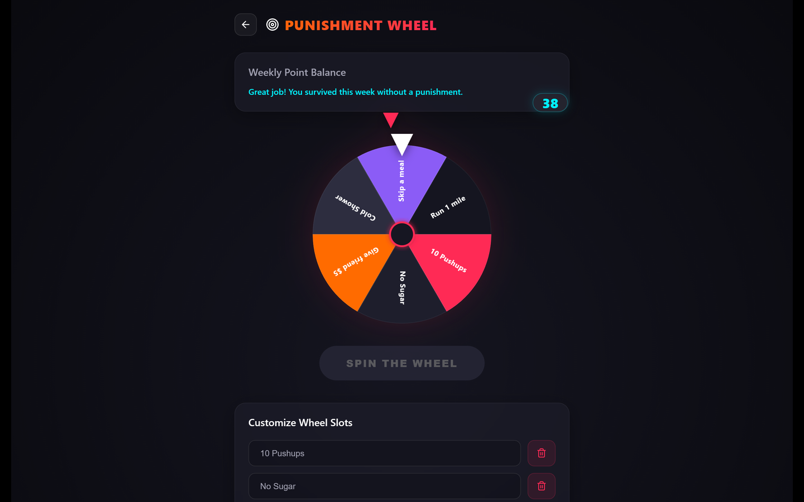</td>
<td width="50%">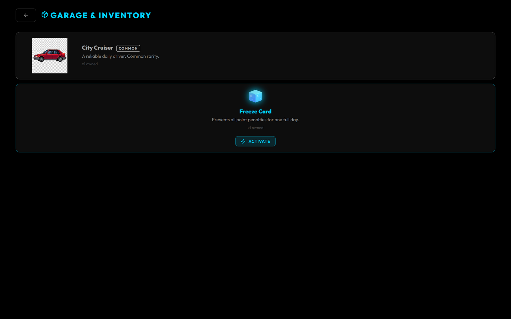</td>
</tr>
</table>

### Friends and settings

<table>
<tr>
<td width="50%">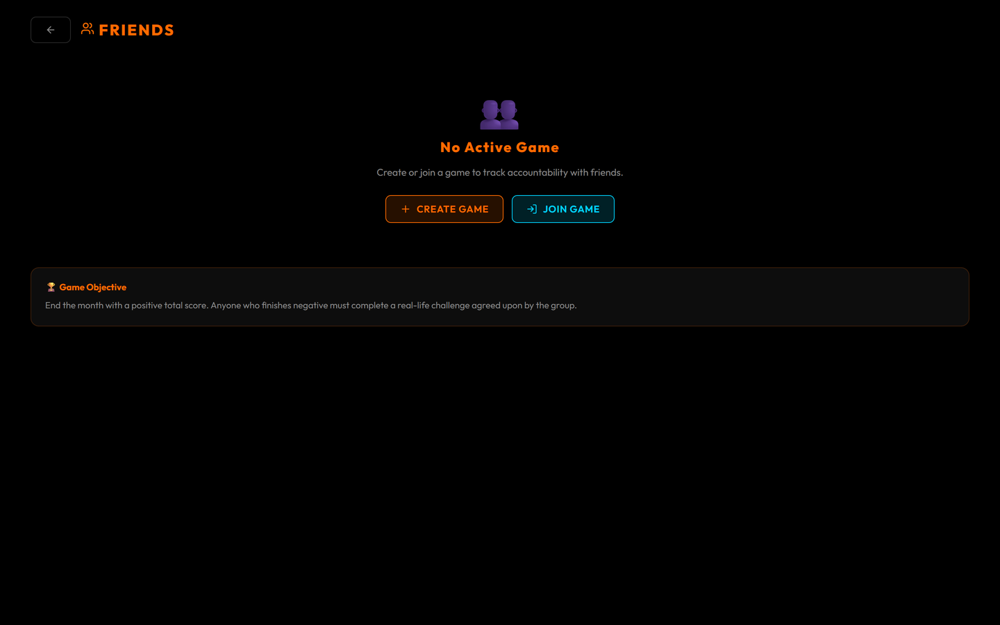</td>
<td width="50%">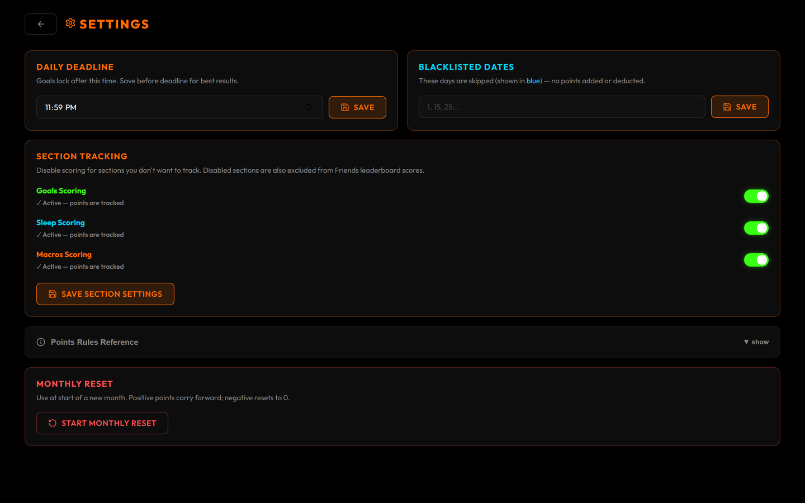</td>
</tr>
</table>

### Feature and scoring breakdown

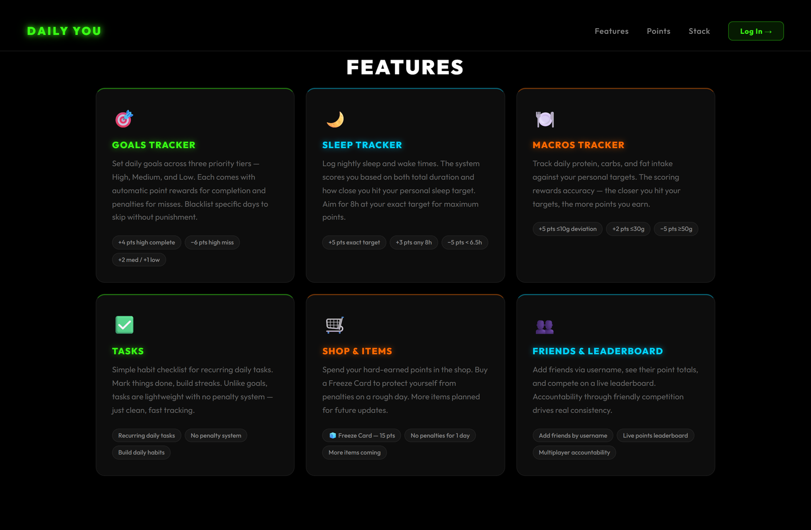

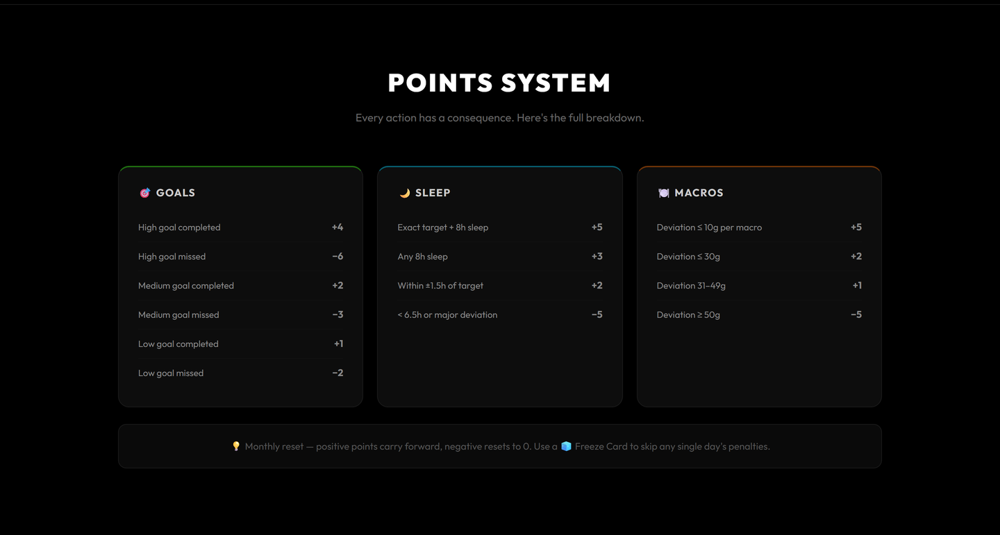

---

## The points system

All scoring lives in [`server/utils/points.js`](server/utils/points.js). Points are calculated
server-side only — the client never decides its own score.

### Goals

| Priority | Completed | Missed |
| --- | :---: | :---: |
| High | **+4** | **−6** |
| Medium | **+2** | **−3** |
| Low | **+1** | **−2** |

Misses cost more than completions earn. Six high-priority goals completed every day for a week
earns 168; missing them all costs 252.

### Sleep

Scored on the gap between your actual sleep duration and the target you set — **not** against a
fixed eight hours.

| Deviation from your target | Points |
| --- | :---: |
| Within 15 minutes | **+5** |
| Within 1 hour | **+3** |
| Within 1.5 hours | **+2** |
| More than 1.5 hours off | **−5** |

Deviation is symmetric: with an 8-hour target, sleeping 10 hours scores the same **−5** as
sleeping 6. Times crossing midnight are handled correctly.

### Macros

Scored on **combined** deviation — `|Δprotein| + |Δcarbs| + |Δfats|` — so you cannot offset a
large miss on one macro by nailing the other two.

| Combined deviation | Points |
| --- | :---: |
| ≤ 10g | **+5** |
| ≤ 30g | **+2** |
| 31–49g | **+1** |
| ≥ 50g | **−5** |

### Shop

| Item | Cost | Effect |
| --- | :---: | --- |
| 🧊 Freeze Card | 15 | Cancels all penalties for one day |
| 🚗 City Cruiser | 50 | Collectible |
| 🏎️ Neon Sprinter | 150 | Collectible |
| 🚙 Cyber Muscle | 300 | Collectible |
| ✨ Aura Supercar | 1000 | Collectible |

### Monthly reset

At the start of each month a positive balance carries forward; a negative one resets to zero.
A bad month does not become an unrecoverable hole.

---

## Architecture

```
daily-you/
├── client/                     React 19 + Vite SPA
│   └── src/
│       ├── api/axios.js        Axios instance, JWT interceptor, error helpers
│       ├── context/            AuthContext — session state and restoration
│       ├── components/Layout/  Shell and header
│       └── pages/              Auth, Goals, Sleep, Macros, Tasks,
│                               Shop, Items, Friends, Wheel, Settings, About
│
├── server/                     Node.js + Express REST API
│   ├── index.js                App setup, CORS, route mounting, health checks
│   ├── models/                 Mongoose schemas
│   ├── routes/                 One router per domain
│   ├── middleware/
│   │   ├── auth.js             JWT verification
│   │   └── autoSaveGoals.js    Settles past days once the deadline passes
│   └── utils/points.js         All scoring logic
│
└── docs/images/                Screenshots and demo GIF
```

**Auth.** Registration hashes passwords with bcrypt (12 rounds) via a Mongoose pre-save hook.
Login issues a JWT valid for 30 days. The client stores it in `localStorage` and an Axios request
interceptor attaches it as a bearer token.

**Session restoration.** On load the app revalidates its cached token against `GET /api/user/me`.
Only a genuine `401` clears the session — network errors and timeouts fall back to the cached user,
so a flaky connection never signs you out.

**Auto-save.** `autoSaveGoals` runs ahead of the goals and user routes. It walks every day from the
start of the month up to the current effective day and settles anything still unscored, then
updates the running total in one write. Goals are only scored from their creation day onward, so
adding a goal mid-month never back-penalises days it did not exist for.

---

## Running it locally

**Prerequisites:** Node.js 18+, npm, and a MongoDB connection string
([Atlas](https://www.mongodb.com/atlas) has a free tier).

```bash
git clone https://github.com/chiranthan-dev/daily-you.git
cd daily-you
```

**1. Start the API**

```bash
cd server
npm install
cp .env.example .env    # then fill in the values below
npm run dev
```

The API comes up on `http://localhost:5000`. Confirm it with:

```bash
curl http://localhost:5000/api/health
```

```json
{ "status": "ok", "db": "connected", "uptime": 12.34 }
```

**2. Start the client**

```bash
cd client
npm install
cp .env.example .env
npm run dev
```

Vite serves on `http://localhost:5173` and proxies `/api` to port 5000 in development.

---

## Environment variables

**`server/.env`**

| Variable | Required | Description |
| --- | :---: | --- |
| `MONGODB_URI` | yes | MongoDB connection string |
| `JWT_SECRET` | yes | Signing secret for tokens — use a long random value |
| `CLIENT_URL` | yes in production | Frontend origin, added to the CORS allowlist |
| `PORT` | no | Defaults to `5000` |

**`client/.env`**

| Variable | Required | Description |
| --- | :---: | --- |
| `VITE_API_URL` | yes | API base URL including `/api` |

```ini
# local development
VITE_API_URL=http://localhost:5000/api
```

> Vite inlines `VITE_*` variables at **build** time, not run time. Changing `VITE_API_URL`
> on your host requires a rebuild for it to take effect.

---

## API reference

All routes are prefixed `/api`. Everything except `/auth/*` and `/health` requires an
`Authorization: Bearer <token>` header.

<details>
<summary><b>Auth</b></summary>

| Method | Endpoint | Description |
| --- | --- | --- |
| `POST` | `/auth/register` | Create an account, returns a token |
| `POST` | `/auth/login` | Sign in, returns a token |

</details>

<details>
<summary><b>Goals</b></summary>

| Method | Endpoint | Description |
| --- | --- | --- |
| `GET` | `/goals` | Goals for the current month |
| `POST` | `/goals` | Create a goal (`title`, `priority`) |
| `PUT` | `/goals/:id/toggle` | Tick or untick a day |
| `PUT` | `/goals/save-all/day` | Settle every goal for a day and apply points |
| `PUT` | `/goals/edit-day` | Reopen a saved day for editing |
| `POST` | `/goals/apply-missed` | Apply penalties for missed days |
| `DELETE` | `/goals/:id` | Delete a goal |

</details>

<details>
<summary><b>Sleep and macros</b></summary>

| Method | Endpoint | Description |
| --- | --- | --- |
| `GET` | `/sleep` · `/macros` | Current month's document |
| `POST` | `/sleep/setup` · `/macros/setup` | Set monthly targets |
| `POST` | `/sleep/log` · `/macros/log` | Log a day and score it |
| `PUT` | `/sleep/edit` · `/macros/edit` | Amend an existing log |
| `POST` | `/sleep/apply-missed` · `/macros/apply-missed` | Apply missed-day penalties |

</details>

<details>
<summary><b>Tasks, shop, items, friends and user</b></summary>

| Method | Endpoint | Description |
| --- | --- | --- |
| `GET` | `/tasks` | List tasks |
| `POST` | `/tasks` | Create a task |
| `PUT` | `/tasks/:id` | Update a task |
| `DELETE` | `/tasks/:id` | Delete a task |
| `POST` | `/tasks/rollover` | Roll unfinished tasks to today |
| `GET` | `/shop/items` | Shop catalogue |
| `POST` | `/shop/buy` | Buy an item (`itemId`) |
| `GET` | `/items` | Your inventory |
| `POST` | `/items/activate` | Activate an owned item |
| `POST` | `/friends/create` | Create a friend game |
| `POST` | `/friends/join` | Join by game code |
| `POST` | `/friends/leave` | Leave the current game |
| `GET` | `/friends/game` | Game state and leaderboard |
| `GET` | `/user/me` | Current user |
| `GET` | `/user/weekly-stats` | Rolling weekly total (drives the wheel) |
| `PUT` | `/user/settings` | Deadline time and blacklisted days |
| `PUT` | `/user/disabled-sections` | Opt a category out of scoring |
| `POST` | `/user/monthly-reset` | Run the monthly reset |
| `POST` | `/user/complete-monthly-setup` | Mark monthly setup done |

</details>

<details>
<summary><b>Health</b></summary>

| Method | Endpoint | Description |
| --- | --- | --- |
| `GET` | `/health` and `/api/health` | Status, database connection, uptime |

Mounted at both paths so it is reachable through the client's configured API base URL as well
as directly — useful for uptime pings.

</details>

---

## Deployment

The live deployment splits across two hosts:

| Piece | Host | Notes |
| --- | --- | --- |
| Client | Vercel | Builds `client/`, output `client/dist` |
| API | Render | Node web service running `server/` |
| Database | MongoDB Atlas | Shared cluster |

`vercel.json` rewrites all routes to `index.html` so client-side routing survives a hard refresh
on a deep link.

Set `CLIENT_URL` on the API host to your frontend origin. Preview deployments on `*.vercel.app`
are matched by pattern, so they work without adding each generated hostname by hand.

> **On free-tier cold starts.** A free Render instance sleeps after roughly 15 minutes idle, and
> the first request back can take 20–60 seconds. The client compensates by pinging `/api/health`
> as soon as the page loads, so the API is usually awake by the time you finish typing your
> credentials. Requests use a 90-second timeout, and a failed one never clears your session.
> To remove the delay entirely, ping the health endpoint on a schedule or move off the free tier.

---

## Design notes

A few decisions worth calling out for anyone reading the source.

**Scoring is server-side, always.** Points are never computed on the client. Every route that
awards or deducts points recalculates from stored state, so a tampered client cannot inflate a
score.

**Days are settled once.** `pointsApplied` records the outcome per goal per day. Once a day is
settled it is skipped on subsequent passes, which makes the auto-save middleware idempotent —
it runs on nearly every authenticated request and must never double-charge.

**Zero is a real value, not a missing one.** Days that are blacklisted, disabled, frozen, or that
predate a goal are stored as an explicit `0` rather than left undefined. Leaving them unset would
make the middleware reconsider them forever.

**The effective day is not the calendar day.** `getEffectiveDay()` shifts the boundary to match
the user's deadline, so someone logging at 01:00 with a 03:00 deadline is still writing to the
previous day.

**Sessions survive bad networks.** Only an explicit `401` ends a session. Anything else — a
timeout, an offline moment, a sleeping server — falls back to the cached user rather than
discarding a valid token.

---

## License

Released under the [MIT License](LICENSE).

<div align="center">

**[Try Daily You](https://daily-you-dun.vercel.app)** · Built by [@chiranthan-dev](https://github.com/chiranthan-dev)

</div>
